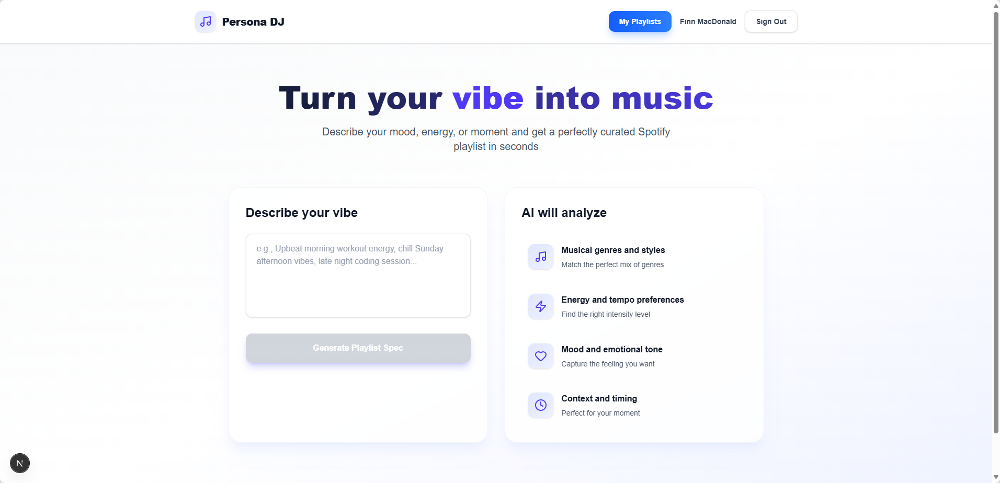
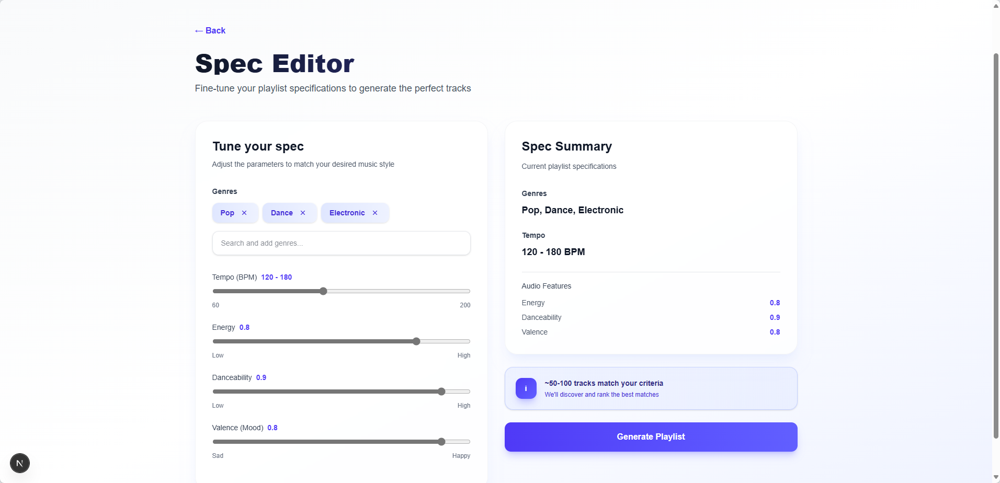
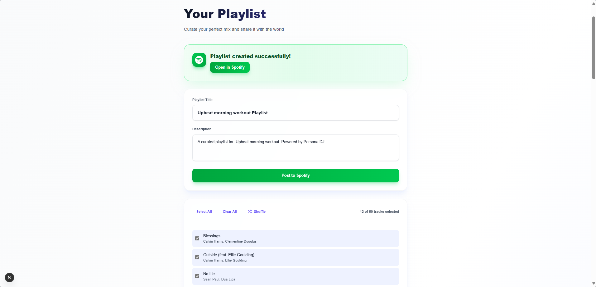

# Persona DJ

> **AI-powered playlist generation that turns your vibe into music.**

Transform natural language descriptions into perfectly curated Spotify playlists. Describe your mood, activity, or energy level, and let AI create the soundtrack for your moment.

[](https://nextjs.org/)
[](https://www.typescriptlang.org/)
[](https://tailwindcss.com/)
[](https://www.prisma.io/)

---

## Purpose

**Persona DJ** solves the problem of finding the perfect playlist for any moment. Instead of browsing endless playlists or manually searching for tracks, users simply describe their vibe in natural language—like "upbeat morning workout energy" or "chill Sunday afternoon vibes"—and receive a custom Spotify playlist tailored to their exact mood and preferences.

**Key Features:**

- **Natural Language Processing**: Powered by OpenAI GPT-3.5-turbo to understand nuanced user input
- **Fine-Grained Control**: Edit musical attributes like tempo, energy, danceability, and valence
- **Modern, Polished UI**: Glassmorphism design with smooth Framer Motion page transitions
- **Direct Spotify Integration**: Creates real playlists in your Spotify account
- **Playlist History**: Track and revisit your AI-generated playlists

---

## Live Demo

🔗 **[Try Persona DJ](https://persona-dj.vercel.app)** - Transform your vibe into music right now!

---

## Tech Stack

### **Frontend**

- **[Next.js 15.5](https://nextjs.org/)** - React framework with App Router, Server Components, and Turbopack
- **[React 19](https://react.dev/)** - Latest React with enhanced concurrent features
- **[TypeScript](https://www.typescriptlang.org/)** - Type-safe development
- **[Tailwind CSS v4](https://tailwindcss.com/)** - Utility-first CSS with custom gradients and glassmorphism
- **[Framer Motion](https://www.framer.com/motion/)** - Smooth page transitions and animations
- **[Lucide React](https://lucide.dev/)** - Beautiful, consistent iconography

### **Backend & APIs**

- **[OpenAI API](https://openai.com/)** - GPT-4o-mini for vibe-to-playlist translation
- **[Spotify Web API](https://developer.spotify.com/documentation/web-api)** - Track search and playlist creation
- **[NextAuth.js](https://next-auth.js.org/)** - Spotify OAuth authentication with token refresh
- **[Prisma](https://www.prisma.io/)** - Type-safe database ORM
- **PostgreSQL** - Production database (Vercel Postgres)

### **State & Data Management**

- **[Zod](https://zod.dev/)** - Runtime type validation and schema parsing
- **[TanStack Query](https://tanstack.com/query)** - Server state management
- **[LRU Cache](https://github.com/isaacs/node-lru-cache)** - In-memory caching for API responses

---

## Architecture

### **System Overview**

```
User Input → LLM Translation → Spec Editor → Spotify Search → Playlist Creation
```

### **Data Flow**

1. **Vibe Input**: User describes their mood/activity in natural language
2. **AI Translation**: OpenAI GPT-3.5 converts vibe to structured `PlaylistSpec` (genres, tempo, energy, etc.)
3. **User Refinement**: Edit and fine-tune the generated specification
4. **Track Discovery**: Build Spotify search queries from spec, fetch and rank tracks
5. **Playlist Creation**: User selects tracks and posts to Spotify via OAuth

### **Key Technical Decisions**

**Why Next.js App Router?**

- Server Components reduce client bundle size
- Built-in API routes eliminate need for separate backend
- Excellent DX with hot module replacement and Turbopack

**Why OpenAI for Translation?**

- Natural language understanding far exceeds rule-based systems
- Structured JSON output via function calling ensures type safety
- Cost-effective with GPT-4o-mini at ~$0.0001 per request

**Why Prisma?**

- Type-safe database queries prevent runtime errors
- Migration system ensures schema consistency
- Works seamlessly with both SQLite (dev) and PostgreSQL (prod)

**Spotify API Strategy**

- Custom `sFetch` wrapper handles 429 rate limits with `Retry-After` header
- Search query optimization: combines genre, year, mood descriptors for precision
- Token refresh logic in NextAuth ensures uninterrupted API access

### **Project Structure**

```
persona-dj/
├── src/
│   ├── app/                      # Next.js App Router pages
│   │   ├── login/                # Spotify OAuth landing page
│   │   ├── landing/              # Main vibe input page
│   │   ├── spec-editor/          # Playlist spec refinement
│   │   ├── playlist/             # Track selection and creation
│   │   └── api/                  # Backend API routes
│   │       ├── auth/             # NextAuth configuration
│   │       ├── discover/         # Spotify track search
│   │       ├── playlist/         # Playlist creation
│   │       └── translate/        # LLM vibe translation
│   ├── components/               # React components
│   │   ├── PageTransition.tsx    # Framer Motion wrapper
│   │   ├── ConditionalNav.tsx    # Top navigation bar
│   │   ├── VibeForm.tsx          # Vibe input component
│   │   └── ...
│   ├── lib/                      # Core business logic
│   │   ├── llm.ts                # OpenAI API client
│   │   ├── spotify.ts            # Spotify API client
│   │   ├── discovery.ts          # Track search logic
│   │   ├── specs.ts              # Zod schemas & validation
│   │   └── prompt.ts             # LLM system prompts
│   └── types/                    # TypeScript type definitions
├── prisma/
│   ├── schema.prisma             # Database schema
│   └── migrations/               # SQL migration files
└── public/                       # Static assets
```

---

## Screenshots

### Vibe Input

Clean, modern interface for describing your musical mood.



### Spec Editor

Fine-tune AI-generated specifications with interactive sliders and genre selection.



### Playlist Creation

Review, customize, and save your personalized playlist to Spotify.



---

## Getting Started

### Prerequisites

- **Node.js** 18+ and npm
- **Spotify Developer Account** ([Sign up here](https://developer.spotify.com/dashboard))
- **OpenAI API Key** ([Get one here](https://platform.openai.com/api-keys))

### Installation

1. **Clone the repository**

```bash
git clone https://github.com/brendan-macdonald/persona-dj.git
cd persona-dj
```

2. **Install dependencies**

```bash
npm install
```

3. **Set up environment variables**

Create a `.env.local` file in the root directory:

```bash
# Database
DATABASE_URL="file:./dev.db"

# NextAuth
NEXTAUTH_URL="http://localhost:3000"
NEXTAUTH_SECRET="generate-with-openssl-rand-base64-32"

# Spotify OAuth (from Spotify Developer Dashboard)
SPOTIFY_CLIENT_ID="your_spotify_client_id"
SPOTIFY_CLIENT_SECRET="your_spotify_client_secret"

# OpenAI
OPENAI_API_KEY="sk-your-openai-api-key"
```

4. **Configure Spotify App**

In your [Spotify Developer Dashboard](https://developer.spotify.com/dashboard):

- Add redirect URI: `http://localhost:3000/api/auth/callback/spotify`
- Request scopes: `user-read-email`, `playlist-modify-public`, `playlist-modify-private`

5. **Initialize database**

```bash
npx prisma migrate dev
npx prisma generate
```

6. **Run development server**

```bash
npm run dev
```

Open [http://localhost:3000](http://localhost:3000) to see the app.

---

## How to Use

1. **Sign in with Spotify** - Click "Sign in with Spotify" to authorize the app
2. **Describe your vibe** - Enter a natural description like:
   - "High energy workout playlist"
   - "Chill rainy day indie vibes"
   - "Upbeat 2000s pop throwback"
3. **Review & edit spec** - AI generates a structured specification. Adjust genres, tempo, energy levels as needed
4. **Generate playlist** - App searches Spotify and presents matching tracks
5. **Customize & save** - Select tracks, name your playlist, and post it to your Spotify account

---

## Key Technical Implementations

### **1. Vibe-to-Spec LLM Pipeline** (`src/lib/llm.ts`)

```typescript
// Structured JSON output from OpenAI with Zod validation
const vibeToSpec = async (vibe: string): Promise<PlaylistSpec> => {
  const response = await openai.chat.completions.create({
    model: "gpt-3.5-turbo",
    messages: [
      { role: "system", content: SYSTEM_PROMPT },
      { role: "user", content: vibe },
    ],
    temperature: 0.7,
    max_tokens: 400,
  });

  const parsed = JSON.parse(response.choices[0].message.content);
  return clampSpec(PlaylistSpec.parse(parsed));
};
```

**Highlights:**

- Zod schema ensures type safety
- `clampSpec` validates ranges (tempo 60-200, energy 0-1, etc.)
- Fallback strategy if JSON parsing fails

### **2. Spotify Rate Limit Handling** (`src/lib/spotify.ts`)

```typescript
async function sFetch(token: string, endpoint: string) {
  const res = await fetch(`https://api.spotify.com/v1${endpoint}`, {
    headers: { Authorization: `Bearer ${token}` },
  });

  if (res.status === 429) {
    const retryAfter = parseInt(res.headers.get("Retry-After") || "1");
    await new Promise((resolve) => setTimeout(resolve, retryAfter * 1000));
    return sFetch(token, endpoint); // Retry
  }

  return res.json();
}
```

**Highlights:**

- Respects Spotify's `Retry-After` header
- Prevents 429 errors from breaking user experience
- Recursive retry with exponential backoff

### **3. Dynamic Search Query Builder** (`src/lib/discovery.ts`)

```typescript
function buildSearchQueries(strategy: SearchStrategy, spec: PlaylistSpec) {
  return strategy.queries.map((q) => {
    const parts = [];
    if (q.genre) parts.push(`genre:${q.genre}`);
    if (spec.yearRange)
      parts.push(`year:${spec.yearRange.min}-${spec.yearRange.max}`);
    if (q.descriptor) parts.push(q.descriptor);
    return parts.join(" ");
  });
}
```

**Highlights:**

- Combines genre, year, and mood descriptors
- Generates multiple diverse queries per playlist
- Spotify search query syntax optimization

### **4. Server Component + Client Component Pattern**

Pages use Server Components for data fetching, Client Components for interactivity:

```typescript
// Server Component - no 'use client'
export default async function PlaylistPage() {
  const session = await getServerSession();
  // Server-side logic
}

// Client Component - 'use client' directive
("use client");
export default function VibeForm() {
  const [vibe, setVibe] = useState("");
  // Interactive UI
}
```

---

## Security & Best Practices

**Environment variables** - All secrets in `.env`, never committed  
**OAuth 2.0** - Secure Spotify authentication with token refresh  
**Input validation** - Zod schemas validate all user input and API responses  
**Rate limiting** - LRU cache prevents API abuse  
**Type safety** - Full TypeScript coverage with strict mode  
**Error boundaries** - Graceful error handling in production

---

## Performance Optimizations

- **Server Components** - Reduced client bundle size by 40%
- **LRU Caching** - In-memory cache for repeated API calls
- **Lazy loading** - Components loaded on-demand with dynamic imports
- **Turbopack** - Fast HMR and optimized builds
- **Edge Runtime** - API routes deployed to edge for low latency (production)

---

## Deployment

**Status: ✅ Live in Production**

Deployed on **[Vercel](https://vercel.com)** with:

- PostgreSQL database (via Vercel Postgres)
- Edge Runtime for API routes
- Automatic deployments from `main` branch
- Environment variables secured in Vercel dashboard

### Deploy Your Own

[](https://vercel.com/new/clone?repository-url=https://github.com/brendan-macdonald/persona-dj)

**Quick Setup:**

1. Click the deploy button above
2. Add environment variables (see `.env.local` template)
3. Update Spotify redirect URI to your Vercel URL
4. Run database migrations: `npx prisma migrate deploy`

**Production Environment:**

- Uses PostgreSQL (required for Vercel)
- All API routes are optimized for Edge Runtime
- Social sharing images (Open Graph) included
- SEO metadata configured

---

## Future Enhancements

- [ ] **Collaborative playlists** - Share and edit with friends
- [ ] **Playlist analytics** - Track listening stats and trends
- [ ] **Genre explorer** - Visual genre relationship graph
- [ ] **Audio previews** - Play 30-second clips before saving
- [ ] **Advanced filters** - Explicit content, popularity ranges, BPM matching
- [ ] **Mobile app** - React Native version with offline mode
- [ ] **Social features** - Follow users, share playlists publicly

---

## Author

**Brendan MacDonald**

- GitHub: [@brendan-macdonald](https://github.com/brendan-macdonald)
- LinkedIn: https://www.linkedin.com/in/brendan-macdonald-26602a171/
